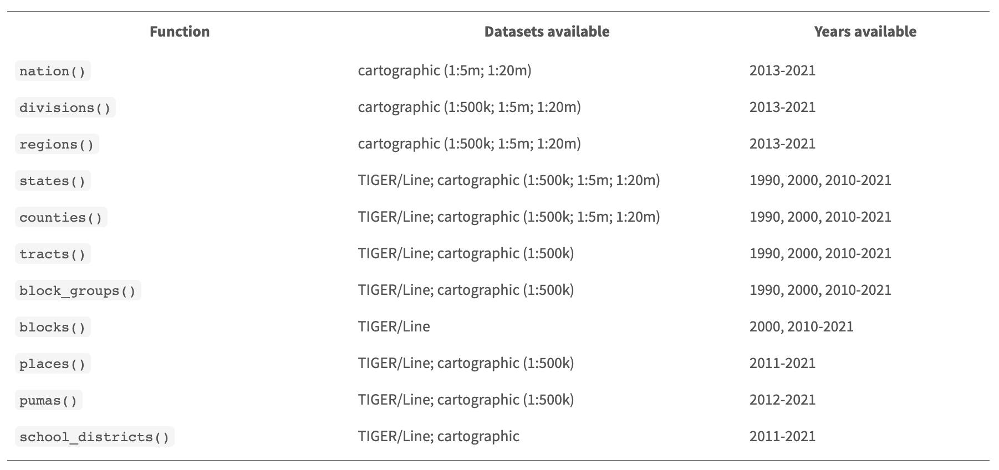

```{r, include=FALSE}
## By default, show code for all chunks in the knitted document,
## as well as the output. To override for a particular chunk
## use echo = FALSE in its options.
knitr::opts_chunk$set(
   echo=TRUE, message=FALSE, warning=FALSE
)
```

```{r, echo=FALSE}
# CONFIG
user_name <- "fernandomillanvillalobos" # your Git username (only needed if
# you want to deploy to GH pages)
project_name <- "adjclass-nando" # adapt!
package_date <- "2022-05-01" # date of the CRAN snapshot that
# the checkpoint package uses
r_version <- "4.2.1" # R-Version to use
options(Ncpus = 4) # use 4 cores for parallelized installation of packages
if (r_version != paste0(version$major, ".", version$minor)) {
  stop("ERROR: specified R version does not match currently used.")
}
```

# Notes

This report was generated on `r Sys.time()`. R version: `r paste0(version$major, ".", version$minor)` on `r version$platform`. For this report, CRAN packages as of `r package_date` were used.

...

## R-Script & data

The preprocessing and analysis of the data was conducted in the [R project for statistical computing](https://www.r-project.org/). The RMarkdown script used to generate this document and all the resulting data can be downloaded [under this link](http://`r user_name`.github.io/`r project_name`/). Through executing `main.Rmd`, the herein described process can be reproduced and this document can be generated. In the course of this, data from the folder `input` will be processed and results will be written to `output`. The html on-line version of the analysis can be accessed through this [link](https://`r user_name`.github.io/`r project_name`/). 

## GitHub

The code for the herein described process can also be freely downloaded from [https://github.com/`r user_name`/`r project_name`](https://github.com/`r user_name`/`r project_name`). 

## License

...

## Data description of output files

#### `abc.csv` (Example)

| Attribute | Type | Description |
|-------|------|-----------------------------------------------------------------------------|
| a | Numeric | ... |
| b | Numeric | ... |
| c | Numeric |  ... |

...

# Set up

```{r, echo=FALSE}
detach_all_packages <- function() {
  basic_packages_blank <-  c("stats",
                             "graphics",
                             "grDevices",
                             "utils",
                             "datasets",
                             "methods",
                             "base")
  basic_packages <- paste("package:", basic_packages_blank, sep = "")

  package_list <- search()[
    ifelse(unlist(gregexpr("package:", search())) == 1, TRUE, FALSE)]

  package_list <- setdiff(package_list, basic_packages)

  if (length(package_list) > 0)  for (package in package_list) {
    detach(package, character.only = TRUE, unload = TRUE)
    print(paste("package ", package, " detached", sep = ""))
  }
}

detach_all_packages()

# this allows multiple persons to use the same RMarkdown
# without adjusting the working directory by themselves all the time
source("scripts/csf.R")
path_to_wd <- csf() # if this - for some reason - does not work,
# replace with a hardcoded path, like so: "~/projects/rddj-template/analysis/"
if (is.null(path_to_wd) | !dir.exists(path_to_wd)) {
  print("WARNING: No working directory specified for current user")
} else {
  setwd(path_to_wd)
}

# suppress scientific notation
options(scipen = 999)

# suppress summarise info
options(dplyr.summarise.inform = FALSE)

# unload global rstudioapi and knitr again to avoid conflicts with checkpoint
# this is only necessary if executed within RStudio
# outside of RStudio, namely in the knit.sh script, this causes RMarkdown
# rendering to fail, thus should not be executed there
if (Sys.getenv("RSTUDIO") == "1") {
  detach_all_packages()
}
```

## Define packages

```{r, echo=TRUE, message=FALSE, warning=FALSE}
# from https://mran.revolutionanalytics.com/web/packages/\
# checkpoint/vignettes/using-checkpoint-with-knitr.html
# if you don't need a package, remove it from here (commenting not sufficient)
# tidyverse: see https://blog.rstudio.org/2016/09/15/tidyverse-1-0-0/
cat("
library(rstudioapi)
library(tidyverse)
library(tidylog)
library(jsonlite)
library(lintr)
library(rmarkdown)
library(sf)
library(rio)
library(cowplot)
library(extrafont)
library(ggrepel)
library(scales)
library(remotes)
library(lubridate)
library(rvest)
library(httr)
library(tidycensus)
library(ggthemes)
library(doParallel)
library(utils)
library(vtable)
library(tigris)
library(viridis)
library(biscale)
library(svglite)
library(janitor)",
file = "manifest.R")
```

## Install packages

```{r, echo=TRUE, message=FALSE, warning=FALSE}
# if checkpoint is not yet installed, install it (for people using this
# system for the first time)
if (!require(checkpoint)) {
  if (!require(devtools)) {
    install.packages("devtools", repos = "http://cran.us.r-project.org")
    require(devtools)
  }
  devtools::install_github("RevolutionAnalytics/checkpoint",
                           ref = "v0.3.2", # could be adapted later,
                           # as of now (beginning of July 2017
                           # this is the current release on CRAN)
                           repos = "http://cran.us.r-project.org")
  require(checkpoint)
}
# nolint start
if (!dir.exists("~/.checkpoint")) {
  dir.create("~/.checkpoint")
}
# nolint end
# install packages for the specified CRAN snapshot date
checkpoint(snapshot_date = package_date,
           project = path_to_wd,
           verbose = T,
           scanForPackages = T,
           use.knitr = F,
           R.version = r_version)
rm(package_date)
```

## Load packages

```{r, echo=TRUE, message=FALSE, warning=FALSE}
source("manifest.R")
unlink("manifest.R")
sessionInfo()
```

## Load additional scripts

```{r, echo=TRUE, message=FALSE, warning=FALSE}
# if you want to outsource logic to other script files, see README for 
# further information
# Load all visualizations functions as separate scripts
knitr::read_chunk("scripts/dviz.supp.R")
source("scripts/dviz.supp.R")
knitr::read_chunk("scripts/themes.R")
source("scripts/themes.R")
knitr::read_chunk("scripts/plot_grid.R")
source("scripts/plot_grid.R")
knitr::read_chunk("scripts/align_legend.R")
source("scripts/align_legend.R")
knitr::read_chunk("scripts/label_log10.R")
source("scripts/label_log10.R")
knitr::read_chunk("scripts/outliers.R")
source("scripts/outliers.R")
```

# Module 1: Exploring data

In this lesson, we’re going to start exploring data with the package dplyr.

- It’s designed to work with data frames, which is what journalists are used to
- Great for data exploration and transformation
- Intuitive to write and easy to read, especially when using the “chaining” syntax of pipes
- These are the functions/data analysis verbs we’ll be going over:

- `filter()`
- `select()`
- `arrange()`
- `mutate()`
- `summarize()` plus `group_by()`

```{r, fig.cap=c("Module 1: Analyzing data with R"), out.width="100%", out.height="600px", echo=FALSE, fig.show='hold'}
knitr::include_graphics("input/pdf/ADJ_Class_1.pdf")  
```

```{r}
# getting the data https://www.fema.gov/openfema-data-page/disaster-declarations-summaries-v2
df <- read_csv("https://www.fema.gov/api/open/v2/DisasterDeclarationsSummaries.csv") %>% 
  glimpse()

# getting the range
range(df$incidentBeginDate)

# exploring the data with table()
table(df$incidentType)
# or with count()
incident_types <- count(df, incidentType, name = "total") # rename the default "n" column
incident_types

# arranging the data
incident_types_arranged <- arrange(incident_types, desc(total))
incident_types_arranged

# pipeing it all
incident_types_arranged <- df %>%
  count(incidentType, name = "total") %>%
  arrange(desc(total))
incident_types_arranged

# filtering
incident_types_arranged_filtered <- incident_types_arranged %>%
  filter(incidentType != "Biological")
incident_types_arranged_filtered

# filtering by multiple values
incident_types_arranged %>%
  filter(incidentType == "Tornado" | incidentType == "Hurricane")

# using an array to filter
disaster_array <- c("Tornado", "Hurricane", "Flood")
incident_types_arranged %>%
  filter(incidentType %in% disaster_array)

# missing values
head(is.na(df$incidentType))
sum(is.na(df$incidentType))

# using select()
nrow(df)
colnames(df)

df_narrow <- df %>%
  select(
    femaDeclarationString, state, declarationDate,
    fyDeclared, designatedArea, incidentType
  )
colnames(df_narrow)

# using slice()
rev_chron_floods <- df %>%
  filter(incidentType == "Flood") %>%
  arrange(desc(declarationDate)) %>%
  slice(1:5)
rev_chron_floods

# using mutate()
floods <- df %>%
  filter(incidentType == "Flood")
floods_adjusted <- floods %>%
  mutate(year = year(declarationDate)) %>%
  select(year, declarationDate, fyDeclared)
floods_adjusted

# using summarize()
floods %>%
  mutate(year = year(declarationDate)) %>%
  group_by(year) %>%
  summarize(total = n())

# using case_when()
floods_match <- floods_adjusted %>%
  mutate(
    year_match =
      case_when(
        year == fyDeclared ~ "Match",
        TRUE ~ "Not a match"
      )
  ) %>%
  group_by(year_match) %>%
  summarize(total = n())
floods_match

# using pull()
floods_match_count <- floods_match %>%
  filter(year_match == "Not a match") %>%
  pull(total)
floods_match_count

# getting the pct
total_obs <- nrow(floods)
floods_match_count / total_obs * 100
round(floods_match_count / total_obs * 100, 1)

# Which year had the most floods declarations?
annual_floods <- df %>%
  filter(incidentType == "Flood") %>%
  mutate(year = year(declarationDate)) %>%
  group_by(year) %>%
  summarize(total = n()) %>%
  arrange(desc(total))
annual_floods

# Which state has had the most flooding declared disasters?
state_floods <- df %>%
  filter(incidentType == "Flood") %>%
  group_by(state) %>%
  summarize(floods = n()) %>%
  arrange(desc(floods))
state_floods
```
# Module 2: Joins and Strings

Let’s take a moment to talk about the significance of __tidy__ data. It’s the prefix to a lot of the packages and functions we’re using in this class. But it’s also a philosophy when approaching the structure of data.

There’s an ideal structure for how to stack your data.

And that’s with

- Each __variable__ is in its own __column__
- Each __case__ is in its own __row__
- Each __value__ is in its own __cell__

A join combines two data sets by adding the columns of one data set alongside the columns of the other, usually some of the rows of the second data set along with some rows of the first data set.

A successful join requires something consistent between two data sets to match on: __keys__.

The function that’s used most often is `left_join()` because you have one main data set you’d like to supplement with additional columns.

The function works like this:

If the two data frames you want to join have __the same name__:

`left_join(data_frame1, data_frame2, by="shared_column_name")`

If the two data frames you want to join have __different names__:

`left_join(data_frame1, data_frame2, by=c("df1_column"="df_2_column"))`

Notice that the `c()` argument in the second example is different from how we’ve used it before as combine. The `=` column matching operator is specific to `_join()` functions.

 
Now there are a few other joins that have their uses.

- `right_join()`
- `full_join()`
- `semi_join()`
- `anti_join()`

There are many wonderful functions in the __stringr__ package that you do things like detect patterns, see if strings start with with a pattern, or split or join or substitute strings.

Nearly every news story that involves data analysis can be derived from one these formulas.

- Difference
  - x - y
- Percent
  - x / (x + y) * 100
- Percent change
  - (new - old)/old * 100
- Per Capita
  - x / population * some multiplier to raise result to a round number

```{r, fig.cap=c("Module 2: Joins and Strings"), out.width="100%", out.height="600px", echo=FALSE, fig.show='hold'}
knitr::include_graphics("input/pdf/ADJ_Class_2.pdf")
```

```{r}
census_api_key("02898df1b52d892523a165c11b8b9630e646f22b", install = TRUE, overwrite = TRUE)
county_pop <- get_acs(geography = "county", variables = "B01003_001", year = 2020)
df <- read_csv("https://www.fema.gov/api/open/v2/DisasterDeclarationsSummaries.csv")

# combining strings
df_new <- df %>%
  mutate(GEOID = str_c(fipsStateCode, fipsCountyCode))

# joining data frames
joined_new <- left_join(df_new, county_pop, by = "GEOID")
glimpse(joined_new)

# summarizing data
joined_new %>%
  group_by(incidentType) %>%
  summarize(
    declarations = n(),
    avg_pop = mean(estimate, na.rm = T),
    median_pop = median(estimate, na.rm = T)
  ) %>%
  arrange(desc(avg_pop)) %>%
  slice(1:5)

# wrangling data to compare the current months of 2022 with the past months (otherwise we’d be comparing 12 months of data in 2021 to 8 in 2022 which would be misleading)
joined_new %>%
  filter(state == "KY") %>%
  filter(incidentType == "Flood") %>%
  mutate(year = year(incidentBeginDate)) %>%
  # extracting months
  mutate(month = month(incidentBeginDate)) %>%
  # only paying attention to months in current year of data set
  filter(month %in% c(1:8)) %>%
  filter(year == 2020 | year == 2021 | year == 2022) %>%
  group_by(year) %>%
  summarize(
    declarations = n(),
    avg_pop = mean(estimate, na.rm = T),
    median_pop = median(estimate, na.rm = T)
  )

# getting percent
# x / (x + y) * 100
old <- 50 / (50 + 20) * 100
new <- 20 / (20 + 50) * 100

# getting percent change
#  (new - old)/old * 100
(new - old) / old * 100
```

Because you’re working with raw data intended for use by an agency for one thing, you’ll need to be able to reshape the data so you can do your own analysis, which will include math (such as difference, percents, percent change, and per capita).

One advanced technique for transforming data you’ll learn in this section is from the __tidyr__ package.

- pivot_wider()
- pivot_longer()

In R, you pivot data as in you reshape it. This way you can do math easier across all rows and easier to mutate and manipulate (and is also the preferable data structure for most data viz tools). However, if we wanted to make comparisons that would be difficult. So we need to turn this long data into wide data using `pivot_wider()`. What’s really powerful about `pivot_wider()` is the option to be able to draw values from more than one column.


To use the pivot_longer() function which needs:

1. What columns to focus on `cols=`
2. What to name the column with the names of the columns `names_to=`
3. What to name the column with the values `values_to=`

```{r}
# getting the data (long format)
long_flood <- joined_new %>%
  filter(incidentType == "Flood") %>%
  mutate(year = year(incidentBeginDate)) %>%
  # extracting months
  mutate(month = month(incidentBeginDate)) %>%
  # only paying attention to months in current year of data set
  filter(month %in% c(1:8)) %>%
  filter(year == 2020 | year == 2021 | year == 2022) %>%
  group_by(year, state) %>%
  summarize(
    declarations = n(),
    avg_pop = mean(estimate, na.rm = T),
    median_pop = median(estimate, na.rm = T)
  )
head(long_flood)

# pivoting the data (wide format)
wide_flood <- long_flood %>%
  select(-avg_pop, -median_pop) %>%
  pivot_wider(
    names_from = "year",
    values_from = "declarations"
  )
head(wide_flood)

# calculates the percent change between 2022 and 2021
flood_percent_change <- wide_flood %>%
  summarize(
    `2020` = sum(`2020`, na.rm = T),
    `2021` = sum(`2021`, na.rm = T),
    `2022` = sum(`2022`, na.rm = T)
  ) %>%
  mutate(percent_change = (round((`2022` - `2021`) / `2021` * 100, 1)))
flood_percent_change

# drawing values from more than one column
wide_flood_more <- long_flood %>%
  select(-median_pop) %>%
  pivot_wider(
    names_from = "year",
    values_from = c("declarations", "avg_pop")
  )
wide_flood_more

# getting new data
joined_new <- left_join(df_new, county_pop, by = "GEOID") %>%
  mutate(year = year(incidentBeginDate))
  
annual_disasters <- joined_new %>%
  count(incidentType, year, name = "total")

annual_fires <- annual_disasters %>%
  filter(incidentType == "Fire")
annual_fires

fires_wide <- annual_fires %>% 
  pivot_wider(
    names_from = "year",
    values_from = "total"
  )
fires_wide
```
The grammar of graphics lets you approach visualizations structurally, letting you combine and swap out graphical elements into figures that display data meaningfully.

__Aesthetic__

  - The visual property of a graph

  - Position, shape, color, etc.

__Data__

  - A column in a data set
  
Here’s are the core components of the chart above:


Here’s how the data was mapped in ggplot2 code from a data frame:


ggplot(data = DATA) +
  GEOM_FUNCTION(mapping = aes(AESTHETIC MAPPINGS))


Facets show subplots for different subsets of data. The table below shows all the different ways you can use facets– you can break it out by one extra variable or even two.


We can add more customizations to the chart.


Use themes to change the appearance of anything in the plot. While you can customize every font, color, gradient, etc, you can set these styles up ahead of time or use the ones others have created. There are many built-in themes. Make theme adjustments with `theme()`.


```{r}
# plotting the data
ggplot(data = annual_fires) +
  geom_col(aes(x = year, y = total))

# scoping the years to 2010 - 2022
ggplot(data = annual_fires) +
  geom_col(aes(x = year, y = total)) +
  scale_x_continuous(limits = c(2010, 2022), breaks = 2010:2022)

# using facets
annual_disasters %>%
  filter(incidentType %in% c("Hurricane", "Fire", "Flood")) %>%
  ggplot() +
  geom_col(mapping = aes(x = year, y = total)) +
  scale_x_continuous(limits = c(2010, 2022), breaks = 2010:2022) +
  facet_wrap(vars(incidentType), ncol = 1)

# customizing charts
annual_disasters %>%
  filter(incidentType %in% c("Hurricane", "Fire", "Flood")) %>%
  ggplot() +
  geom_col(mapping = aes(x = year, y = total)) +
  scale_x_continuous(limits = c(2010, 2022), breaks = 2010:2022) +
  facet_wrap(vars(incidentType), ncol = 1) +
  labs(
    title = "Disaster declarations since 2010",
    x = "",
    y = "Total",
    caption = "Data: FEMA"
  )

# using themes
annual_disasters %>%
  filter(incidentType %in% c("Hurricane", "Fire", "Flood")) %>%
  ggplot() +
  geom_col(mapping = aes(x = year, y = total)) +
  scale_x_continuous(limits = c(2010, 2022), breaks = 2010:2022) +
  facet_wrap(vars(incidentType), ncol = 1) +
  labs(
    title = "Disaster declarations since 2010",
    x = "",
    y = "Total",
    caption = "Data: FEMA"
  ) +
  # theme_minimal() +
  # bbc_style()
  theme_economist() +
  theme(
    plot.title = element_text(face = "italic")
  )
```

# Module 3: Loops

We create loops to simplify repetitive tasks. Using `i` is arbitrary. You could use any letter or object. But it does take the value of what shows up after `in`. If you want to see how many objects there are in an array, use `length()` and if you want to see how many rows there are in a data frame, use `nrow()` and if you want to see how many columns there are in a data frame, use `ncol()`. Sometimes you’re going to get data split out over several spreadsheets. Loops are a great way to simplify things. 

To make a loop work on importing spreadsheets, you’ll need to know:

1. How many times you need to run the loop
2. The names of the files
3. Figure out what you want to do with the files

First, we need to get the list of spreadsheets that we want to import. We’ll use the function called `list.files()`. Then we use a loop structure where we can use the sheets[i] to refer to specific sheets in the list.

This is the basic structure for if statements. You need a () and {}. You can do multiple tests, too.

if (logical test for true or false) { 
      do something 
   } else if (logical test for true or false) { 
   do something else 
   } else { 
   do this if prior logical tests failed 
   }

When we run scripts and loops currently, they’re done one at a time in a serial form. The next task won’t start until the one before it finishes. But modern computers have multiple cores which enables multiple computations to take place at the same time. There are many ways to run loops in parallel in R, but we’re going to use a package called __doParallel__. To see how many cores your computer’s working with use `detectCores()`. To tell R how many cores we want to use use `registerDoParallel(cores=X)`. One valid criticism about R is that because data is stored into memory, there is an actual limit to what processes it can run. But loops and parallelization can allow you to run analyses on smaller slices of the data before joining.

An API stands for an Application Programming Interface and is an intermediary between a data set and others. It’s a way for people outside someone’s system to query and ask for specific slices of data from the system without getting complete access to their system. It’s like a drive-thru menu at a fast food restaurant.


The basic steps of pulling data from APIs:

- Installed the “jsonlite” packages (later on you may need the __httr__ package)
- Make a “GET” request to the API to pull raw data
- Parse that data from its raw form through JavaScript Object Notification (JSON) into a usable format
- Write a loop to “page” through that data and retrieve the full data set

Once one has dissected the anatomy of an API, you can see how easy it is to build them! Basically anybody with an internet connection, an authorization token, and who knows the grammar of the API can access it. Most APIs are published with extensive documentation to help you understand the available options and parameters. There may be more complicated ways to access APIs that involve including headers. We get API requests into R simply using the R package __jsonlite__ and use the function `fromJSON()`. The __jsonlite__ package just transformed all the squiggles and commas from what you saw in the browser output and gave you a clean looking data frame. If we want multiple combinations of data we can use loops. URLs do not like spaces. URLs require special characters like spaces, quotation marks, and percent signs to be converted into UTF-encoded values. Your browser, if it loaded the URL, automatically replaced the space with a special character `%20`. The function `URLencode()` from the __utils__ package should set this up for us.

There’s a lot of data out there and sometimes you can get it because it’s been posted publicly. The best data for a journalist is a one that hasn’t been scrutinized already. A new package called __rvest__ and it’s part of the tidy universe bundle and it is used for scrapping purposes. First step is reading the HTML page with `read_html()`. Then we’ll need to find the HTML/CSS elements to target. One way is to use inspect element but since we’ve already installed __selector gadget__ we’ll use that instead.

So, the `read_html()` and `html_nodes()` and `html_text()` functions are all you’ll need for many common web scraping tasks.

- Get the HTML for the webpage you want
- Decide what part of the page to focus on and figure out what HTML or CSS to select it
- Select that HTML and analyze it

There are others, though.

- `html_attr()` for grabbing links
- `html_table()` to parse an html table into a data frame
- `html_form_submit()` if you want to set values in a form submission

When scraping we’ll set a timer at the end of the loop to wait after each loop so we don’t overwhelm their servers (or get banned). The function is `Sys.sleep()`.

Sometimes you may not need to scrape a website if you can find the JSON a website loads to run. If you enable “Inspect Element” in your browser, you can see all the pieces that a website needs to run when you reload it. If you scrape data, try to follow these general rules:

1. Do not overwhelm their servers. Put in pauses so you’re not effectively running a distributed denial of service attack on them.
2. Do not display any raw data that could identify individuals in the data
3. Only show data relevant to your story and proves your methodology and not any proprietary information

```{r, fig.cap=c("Module 2: Loops"), out.width="100%", out.height="600px", echo=FALSE, fig.show='hold'}
knitr::include_graphics("input/pdf/ADJ_Class_3.pdf")
```

```{r}
# basic for loop structure
for (i in 1:10) {
  print(i)
}

# using length()
states <- c("Texas", "Florida", "California", "New York", "Indiana", "Maine")

for (arbitrary_name in 1:length(states)) {
  print(arbitrary_name)
}

for (i in 1:length(states)) {
  print(str_c("array object ", i, " is ", states[i]))
}

# getting the data
df1 <- read_csv("input/covid_data/2020-01.csv")
df2 <- read_csv("input/covid_data/2020-02.csv")
df <- rbind(df1, df2) %>% 
  glimpse()

# getting the list of data files
sheets <- list.files("input/covid_data", full.names = TRUE)
sheets
length(sheets)

# importing the data in an iterative way (but not saving it!)
for (i in 1:length(sheets)) {
  read_csv(sheets[i])
  print(sheets[i])
}

# importing the data and saving as one big data frame
for (i in 1:length(sheets)) {
  df <- read_csv(sheets[i])

  # if first time looping, save df as big_df
  if (i == 1) {
    big_df <- df
  } else {
    # if not the first time looping, then rbind it to big_df
    big_df <- rbind(big_df, df)
  }

  print(nrow(big_df))
}
glimpse(big_df)

# detecting cores
detectCores()

# how many cores
registerDoParallel(cores = 4)

# checking system time
system.time(
  for (i in 1:length(sheets)) {
    df <- read_csv(sheets[i])

    # if first time looping, save df as big_df
    if (i == 1) {
      big_df <- df
    } else {
      # if not the first time looping, then rbind it to big_df
      big_df <- rbind(big_df, df)
    }

    print(nrow(big_df))
  }
)

# checking in pararell
system.time(
  big_df <- foreach(i = 1:length(sheets), .combine = rbind) %dopar% {
    read_csv(sheets[i])
  }
)

# getting JSON requests from APIs
url <-"https://arcos-api.ext.nile.works/v1/combined_county_annual?key=WaPo&county=Mingo&state=WV"
mingo <- fromJSON(url)
mingo

# getting more data
base <- "https://arcos-api.ext.nile.works/v1/combined_county_annual"
county <- "Palm Beach"
county <- URLencode(county)
state <- "FL"
info_key <- "key=WaPo"

API_URL <- str_c(base, "?county=", county, "&state=", state, "&", info_key)

fromJSON(API_URL)

# looping to make an API call
counties <- c("Broward", "Miami-Dade", "Palm Beach")
base <- 'https://arcos-api.ext.nile.works/v1/combined_county_annual'

for (i in 1:length(counties)) {
  county <- counties[i]
  county <- URLencode(county)
  state <- "FL"
  info_key <- "key=WaPo"
  API_URL <- str_c(base, "?county=", county, "&state=", state, "&", info_key)

  df <- fromJSON(API_URL)

  if (i == 1) {
    tidy_df <- df
  } else {
    tidy_df <- rbind(tidy_df, df)
  }
}

tidy_df

# reading HTML with rvest::read_html()
url <- "https://www.amazon.com/product-reviews/B09XF2Z12G/"
amazon <- read_html(url)
amazon

# getting the elements and content (text)
ratings <- amazon %>%
  html_nodes("#cm_cr-review_list .review-rating") %>%
  html_text()
ratings

dates <- amazon %>%
  html_nodes("#cm_cr-review_list .review-date") %>%
  html_text()
dates

review_text <- amazon %>%
  html_nodes(".a-spacing-small.review-data") %>%
  html_text()
review_text

some_reviews <- data.frame(ratings, dates, review_text)
glimpse(some_reviews)

# wrangling the data
some_reviews <- some_reviews %>%
  mutate(
    # Need to get the ratings into a numeric format instead of sentence format
    ratings = str_replace(ratings, " out of 5 stars", ""),
    ratings = as.numeric(ratings),
    # Need to turn the dates into a date format instead of sentence format
    dates = str_replace(dates, ".* on ", ""),
    dates = mdy(dates),
    # Let's get rid of extra spaces and \ns taht indicate line breaks in the html code
    review_text = str_trim(review_text)
  )

glimpse(some_reviews)

# getting the total number of reviews
total_reviews <- amazon %>%
  html_nodes("#filter-info-section .a-size-base") %>%
  html_text() %>%
  str_trim() %>%
  str_replace(".*ratings, ", "") %>%
  parse_number()

total_reviews

# looping throughout all pages
for (i in 1:round(total_reviews / 10)) {
  base_url <- "https://www.amazon.com/48GB-Digital-Voice-Recorder-Dictaphone/product-reviews/B09XF2Z12G/?ie=UTF8&reviewerType=all_reviews&pageNumber="
  new_url <- str_c(base_url, i)
  amazon <- read_html(new_url)

  ratings <- amazon %>%
    html_nodes("#cm_cr-review_list .review-rating") %>%
    html_text()

  dates <- amazon %>%
    html_nodes("#cm_cr-review_list .review-date") %>%
    html_text()

  review_text <- amazon %>%
    html_nodes(".a-spacing-small.review-data") %>%
    html_text()

  some_reviews <- data.frame(ratings, dates, review_text) %>%
    mutate(
      ratings = str_replace(ratings, " out of 5 stars", ""),
      ratings = as.numeric(ratings),
      dates = str_replace(dates, ".* on ", ""),
      dates = mdy(dates),
      review_text = str_trim(review_text)
    )

  if (i == 1) {
    all_reviews <- some_reviews
  } else {
    all_reviews <- rbind(all_reviews, some_reviews)
  }
  Sys.sleep(1)
}

all_reviews

# intercepting the JSON
url <- "https://sinclairresources.s3.amazonaws.com/assets/sbgi/MetaverseStationData.json?1663533398739"
sinclair <- fromJSON(url)
sinclair
```
# Module 4: Statistics

There are so many different statistical methods we could spend several months learning but only a handful that have been used often by journalists. Some of the most common basic descriptive stats you can do is calculating __mean__ and __median__. The __percent__ is another form of descriptive statistics common in data journalism. Another statistical measure is the __standard deviation__ which determines how spread out the numbers are. The formula is essentially the square root of the Variance. And the variance is the average of the squared differences from the Mean. But the function we’ll use is simply `sd()`. The function to check for a correlation between two arrays is `cor()`. The base R function `cor()` allows you to compute correlations using Pearson, Kendall tau or Spearman rho. Some authors consider a strong correlation over [.6, -.6] and over [.8/, -.8] is a very strong correlation.

If you’re comparing numbers with numbers, it’s easier to turn one set of numbers into quantiles, for example taking a range of numbers and grouping them into “low”, “medium”, or “high” categories. This way you can create crosstabs and get around having to use correlations in your narrative. Quantiles are a range from any value to any other value. Percentiles and Quartiles are simply types of Quantiles.

- 4-quantiles are called quartiles
- 5-quintiles are called quintiles
- 10-quantiles are called deciles
- 100-quantiles are called percentiles

To group numbers into sections, we’ll use the `ntile()` function. The way `ntile()` works is the first argument is the column you’d like to evaluate and the second argument is the number of groups you’d like. The `quantile()` function is nearly the same thing but takes percentiles as inputs. Because we’re creating 4 groups, we’ll add a column called quartile. Now, you can use `case_when()` to create a new column for lowest salary, lower salary, higher salary, and highest salary based on the quartile column you created. What if you joined median income for zip codes from the Census to this data? If you joined additional numerical data to this you could use `group_by()` on the quartile column to calculate the percent of workers living in poor or rich neighborhoods. Or perhaps even those who live outside Boston city borders? Anyway, that’s the benefit of adding quartiles via mutate.

Sometimes it’s important to account for confounding factors that may better explain relationships between data points. To prepare our data for regression analysis we can start for grouping some variables. Then we can create a new variable for the natural log of our variable of interest. Essentially, logs are a simpler way to represent large numbers. For example, 10,000,000,000 can be written as 10¹⁰. The new function we’ll use is predictably called `log()` and we’ll pass it the argument of how many exponents we want (just 1). The time creating models is like 85% cleaning and prepping the data. The base R function `lm()` perform linear regression, assessing the relationship between numeric response and explanatory variables that are assumed to have a linear relationship. Provide the equation as a formula, with the response and explanatory column names separated by a tilde `~`. Also, specify the data set to `data =`. Define the model results as an R object, to use later. First, we’ll run the simplest possible model with no controls at all, regressing salary only on a male-female gender dummy. This is equivalent to calculating the approximate overall percentage pay gap between men and women — what we call the “unadjusted” pay gap. We’re looking for the relationship between `log_base` and `gender`. Then use the `summary()` function to output the results. A coefficient of 0.095 means there is approximately 9.5 percent “unadjusted” gender pay gap in this theoretical company. In a story, you would write that men on average earn about 9.5 percent more than women on average in this company.

Mapping is really fun to do in R. You don’t need to pay crazy amounts of money to use ArcGIS. And while QGIS is excellent it has the drawbacks of most click-buttons-to-create programs: You can’t write a script to process the data, transform it, and visualize it in multiple ways. We’re going to use the __sf__ package that will essentially let you treat maps like a geometry in __ggplot2__. It can be as simple as creating a bar chart or line chart.

So __sf__ stands for Simple Features which is a set of standards the community have agreed upon to create a uniform way to store types of spatial data with different geometries, like points, lines, polygons, etc. What this means is when you import maps into R, it will be treated like a data frame. With rows and columns that you can summarize or join with other data sets for enhanced analysis.Bringing in a shape file is as similar as importing a csv! It just as an extra column called geometry.

If you had the shapefiles locally, you could import it in using `st_read()` from the package __sf__. The geometry column says “MULTIPOLYGON”. Polygon is another word for shape. The geometry function for a polygon is `geom_sf()`. It is kind of a process to download a shapefile, locate it locally, and then import it. Because this is R, it´s possible that someone’s already come up with a package to download the most-common per-country borders from the cloud. The __tigris__ package can download the shapefiles for counties and work with FEMA data for USA. For European countries, you can use the __giscoR__ package, for Brazil, there’s the __geobr__ package, etc. To start out with, we’ll load the library and call in the shapes of all the states. Once we have the shapes, we need to bring in the data to join to it so we can make for instance a choropleth. The choropleths are univarate maps, as in it visualizes one column of data. On the other hand a bivariate map involves visualizing two columns of data. This is pretty rare and difficult to make because it requires calculating quartiles of data and the relationship between the two variables.



```{r}
# getting the data
# candles <- read_csv("input/scented.csv")
# glimpse(candles)
# 
# # calculating the mean and the median
# candles %>%
#   summarize(
#     avg_rating = mean(Rating),
#     median_rating = median(Rating)
#   )
# 
# # calculating the distribution of the rating percent
# candles %>%
#   group_by(Rating) %>%
#   summarize(total = n()) %>%
#   mutate(percent = round(total / sum(total) * 100, 1))
# 
# # calculating which 10 months had the greatest deviation (sd())
# candles_monthly <- candles %>%
#   mutate(year = year(Date)) %>%
#   mutate(month = month(Date)) %>%
#   group_by(year, month) %>%
#   summarize(
#     ratings = n(),
#     avg_rating = mean(Rating, na.rm = T),
#     sd_rating = sd(Rating, na.rm = T)
#   ) %>%
#   ungroup() %>%
#   arrange(desc(sd_rating)) %>%
#   filter(year > 2018) %>%
#   slice(1:10)
# 
# candles_monthly
# 
# # calculating the percent of reviews by month that mention not having a smell
# mutate(no_scent = case_when(
#   str_detect(Review, "[Nn]o scent") ~ 1,
#   str_detect(Review, "[Nn]o smell") ~ 1,
#   str_detect(Review, "[Dd]oes not smell like") ~ 1,
#   str_detect(Review, "[Dd]oesn't smell like") ~ 1,
#   str_detect(Review, "[Cc]an't smell") ~ 1,
#   str_detect(Review, "[Cc]annot smell") ~ 1,
#   str_detect(Review, "[Ff]aint smell") ~ 1,
#   str_detect(Review, "[Ff]aint scent") ~ 1,
#   str_detect(Review, "[Dd]on't smell") ~ 1,
#   str_detect(Review, "[Ll]ike nothing") ~ 1,
#   TRUE ~ 0
# ))
# 
# scented_timeline_monthly1
# 
# # calculating the percent for each month and year
# scented_timeline_monthly2 <- scented_timeline_monthly1 %>%
#   mutate(
#     year = year(Date),
#     month = month(Date)
#   ) %>%
#   # let's aggregate around year and month
#   group_by(year, month) %>%
#   # we just need to add up the 1s in no_scent and count up the total reviews with n()
#   summarize(no_scent = sum(no_scent), reviews = n()) %>%
#   # and do some math
#   mutate(percent = no_scent / reviews * 100) %>%
#   select(year, month, value = percent) %>%
#   mutate(type = "percent no smell") %>%
#   ungroup() %>%
#   mutate(row = row_number())
# 
# scented_timeline_monthly2
# 
# # plotting it
# ggplot(data = scented_timeline_monthly2, aes(x = row, y = value)) +
#   geom_line() +
#   geom_smooth() +
#   theme_minimal() +
#   labs(
#     title = "Percent of Yankee Candle reviews mentioning no smell",
#     y = "Percent", x = ""
#   )

# getting daily Covid-19 case counts 
covid <- read_csv("https://github.com/CSSEGISandData/COVID-19/raw/master/csse_covid_19_data/csse_covid_19_time_series/time_series_covid19_confirmed_US.csv")

covid_long <- covid %>%
  pivot_longer(cols = 12:ncol(covid), names_to = "date", values_to = "cases") %>%
  mutate(date = mdy(date)) %>%
  group_by(FIPS) %>%
  arrange(date) %>%
  # this is a way to create a value from the previous value (lagged)
  mutate(positive = c(cases[1], diff(cases))) %>%
  group_by(date) %>%
  summarize(value = sum(positive, na.rm = T)) %>%
  mutate(type = "Covid cases")

covid_long

# monthly daily cases adjusted for 1000000
covid_long_monthly <- covid_long %>%
  mutate(
    year = year(date),
    month = month(date)
  ) %>%
  group_by(year, month) %>%
  summarize(value = sum(value, na.rm = T) / 1000000) %>%
  mutate(type = "Covid cases") %>%
  ungroup() %>%
  mutate(row = row_number())

covid_long_monthly

# comparing trend lines for both data sets
# This only works because we were careful to make sure the column names match
# from the different data sets
# monthly <- rbind(covid_long_monthly, scented_timeline_monthly2)
# 
# monthly %>%
#   ggplot(aes(x = row, y = value)) +
#   geom_line() +
#   facet_wrap(vars(type), scale = "free_y") +
#   geom_smooth()
# 
# # another way of plotting it
# monthly %>%
#   ggplot(aes(x = row, y = value, color = type)) +
#   geom_line() +
#   geom_smooth() +
#   theme_minimal() +
#   labs(title = "Covid cases versus Amazon 'no scent' candle reviews")
# 
# # reshaping data from long to wide to check correlation
# monthly_wide <- monthly %>%
#   pivot_wider(names_from = "type", values_from = "value") %>%
#   filter(!is.na(`percent no smell`))
# 
# glimpse(monthly_wide)

# getting the data
boston_salaries <- read_csv("input/boston.csv")
glimpse(boston_salaries)

# this makes it random but consistent for all of us
set.seed(2022)

# getting randomly selected sample (16)
boston16 <- boston_salaries %>% 
  sample_n(16)

boston16

# using the kable() function from the knitr package to present the data frame
boston16 %>%
  select(TOTAL_GROSS, POSTAL) %>%
  arrange(TOTAL_GROSS) %>%
  knitr::kable()

# grouping quartiles with ntile()
boston16 %>%
  select(TOTAL_GROSS, POSTAL) %>%
  arrange(TOTAL_GROSS) %>%
  mutate(quartile = ntile(TOTAL_GROSS, 4)) %>%
  knitr::kable()

# making percentiles with quantile()
boston16 %>%
  select(TOTAL_GROSS) %>%
  arrange(TOTAL_GROSS) %>%
  summarize(value = quantile(TOTAL_GROSS, c(0, .25, .5, .75, 1))) %>%
  mutate(
    percentile = c(0, 25, 50, 75, 100),
    quartile = c(0, 1, 2, 3, 4)
  ) %>%
  select(percentile, quartile, value)

# getting the data
salaries = read_csv("input/salary_data.csv")
glimpse(salaries)

# grouping employee ages
# Base pay summary stats.
salaries_adjusted1 <- salaries %>%
  # Age brackets
  mutate(age_bin = case_when(
    age < 25 ~ 1, # Below age 25
    age >= 25 & age < 35 ~ 2, # Age 25-34
    age >= 35 & age < 45 ~ 3, # Age 25-34
    age >= 45 & age < 55 ~ 4, # Age 25-34
    age >= 55 ~ 5 # Age 25-34
  ))

salaries_adjusted1

# calculating logs
salaries_adjusted2 <- salaries_adjusted1 %>%
  # Total compensation
  mutate(total_pay = basePay + bonus) %>%
  # Log of compensation
  mutate(
    log_base = log(basePay, base = exp(1)),
    log_total = log(total_pay, base = exp(1)),
    # Adds 1 to allow for log of 0 bonus values.
    log_bonus = log(bonus + 1, base = exp(1))
  )

salaries_adjusted2

# adding a new numerical variable to change Male to 1 and Female to 0
salaries_adjusted3 <- salaries_adjusted2 %>%
  # Make flags
  mutate(male = case_when(
    gender == "Male" ~ 1,
    TRUE ~ 0
  ))

glimpse(salaries_adjusted3)

# looking at summarized statistics with st() function from vtable package
st(salaries_adjusted3)

# calculating mean and median for base pay by gender
summary_base <- salaries_adjusted3 %>%
  group_by(gender) %>%
  summarise(
    meanBasePay = mean(basePay, na.rm = TRUE),
    medianBasePay = median(basePay, na.rm = TRUE),
    employees = n()
  )

summary_base

# looking at job clustering between gender
unadjusted_jobs <- salaries_adjusted3 %>%
  group_by(jobTitle, gender) %>%
  summarise(
    meanTotalPay = mean(total_pay, na.rm = TRUE),
    employees = n()
  )

unadjusted_jobs

# calculating linear regression
# No controls. ("unadjusted" pay gap.)
lm_gender <- lm(log_base ~ gender, data = salaries_adjusted3)
summary(lm_gender)

#  we’ll run a more complete model that adds in variables for employee characteristics like highest education, years of experience and performance evaluation scores by adding "human capital" controls (performance evals, age and education).
lm_humancapital <- lm(log_base ~ gender + perfEval + age_bin + edu, data = salaries_adjusted3)
summary(lm_humancapital)

# adding all controls ("adjusted" pay gap)
lm_allcontrols <- lm(log_base ~ gender + perfEval + age_bin + edu +
  dept + seniority + jobTitle,
data = salaries_adjusted3
)
summary(lm_allcontrols)

# testing for differences in the gender pay gap among departments or job titles 
# All controls with job title interaction terms.
job_results <- lm(log_base ~ male * jobTitle + perfEval + age_bin + edu + seniority + dept, data = salaries_adjusted3)
# Publish a clean table of regression results.
summary(job_results)

# Download the shapefile. (note that I store it in a folder called DATA. You have to change that if needed.)
# download.file("http://thematicmapping.org/downloads/TM_WORLD_BORDERS_SIMPL-0.3.zip", destfile = "input/world_shape_file.zip")
# You now have it in your current working directory, have a look!

# Unzip this file. You can do it with R (as below), or clicking on the object you downloaded.
# unzip("input/world_shape_file.zip", exdir = "input")
#  -- > You now have 4 files. One of these files is a .shp file! (TM_WORLD_BORDERS_SIMPL-0.3.shp)
world <- st_read("input/TM_WORLD_BORDERS_SIMPL-0.3.shp")
glimpse(world)

# USA states (with tigris package)
us_states <- states(cb = TRUE, resolution = "20m") %>%
  shift_geometry()
glimpse(us_states)

# mapping USA states
ggplot(us_states) + 
  geom_sf()

# mapping USA counties
us_counties <- counties(cb = TRUE, resolution = "20m") %>%
     shift_geometry()
glimpse(us_counties)

ggplot(us_counties) + 
  geom_sf() +
  theme_void()

# getting the data
df <- read_csv("https://www.fema.gov/api/open/v2/DisasterDeclarationsSummaries.csv")
df_new <- df %>%
  mutate(GEOID = str_c(fipsStateCode, fipsCountyCode))
fema_counties <- left_join(df_new, county_pop, by = "GEOID")
glimpse(fema_counties)

# summarizing the data by counting up the number of disasters by county
fema_counties_count <- fema_counties %>%
  filter(incidentType != "Biological") %>%
  group_by(GEOID) %>%
  summarize(disasters = n())
fema_map <- left_join(us_counties, fema_counties_count)
glimpse(fema_map)

# plotting a choropleth
fema_map %>%
  ggplot() +
  geom_sf(aes(fill = disasters), color = NA) + # getting rid of the state borders
  scale_fill_viridis(direction = -1) + # reversing the order
  theme_void()

# plotting hurricanes in Lousiana
fema_map %>%
  filter(STUSPS == "LA") %>%
  ggplot() +
  geom_sf(aes(fill = disasters), color = NA) +
  scale_fill_viridis(direction = -1) +
  theme_void() +
  labs(title = "Hurricane declared disasters since 1954")

# counting up Fire disaster declarations by county
fema_counties_count_fi <- fema_counties %>%
  filter(incidentType == "Fire") %>%
  mutate(year = year(incidentBeginDate)) %>%
  group_by(GEOID, year) %>%
  summarize(disasters = n())

fema_map_fi <- left_join(us_counties, fema_counties_count_fi)

glimpse(fema_map_fi)

fema_map_fi %>%
  filter(STUSPS == "CA") %>%
  filter(year %in% c(2017:2022)) %>%
  ggplot() +
  geom_sf(data = filter(us_states, STUSPS == "CA"), fill = "gray", color = NA) +
  geom_sf(aes(fill = disasters), color = NA) +
  scale_fill_viridis(direction = -1, na.value = "red") +
  facet_wrap(vars(year)) +
  theme_void()

# knowing areas that have been hit by Hurricanes most frequently in relation to population
disaster_count <- fema_counties %>%
  # filter county data to just hurricanes
  filter(incidentType == "Hurricane") %>%
  mutate(year = year(incidentBeginDate)) %>%
  # We want to focus on the years between 2017 and 2022
  filter(year %in% c(2017:2022)) %>%
  # Grouping by county IDS so we can join with mapping data easily
  group_by(GEOID) %>%
  summarize(total = n())

# start with the map of counties and join the disaster count
disaster_counties <- left_join(us_counties, disaster_count) %>%
  select(-NAME)

# Then join the population count to the counties data
disaster_counties <- left_join(disaster_counties, county_pop)
glimpse(disaster_counties)

# looking at population (estimate) and hurricanes (total) by county
bi_df <- bi_class(disaster_counties, x = estimate, y = total, style = "quantile", dim = 3)
glimpse(bi_df) # in the new column bi_class “2-1” means the first variable is in the 2nd quartile for one variable and the 1st quartile for the other variable. And then there are NAs because there aren’t enough data to determine a quartile (Those are probably counties with a history of zero hurricanes).

# plotting the map
map <- ggplot() +
  geom_sf(
    data = bi_df, mapping = aes(fill = bi_class),
    # changing the border color to white and the size of the
    # border lines to .1
    # and hiding the legend
    color = "white", size = 0.1, show.legend = FALSE
  ) +
  bi_scale_fill(pal = "GrPink", dim = 3) +
  labs(
    title = "Hurricanes & Population"
  ) +
  bi_theme()
map

# adding a legend
legend <- bi_legend(
  pal = "GrPink",
  dim = 3,
  xlab = "+ population ",
  ylab = "+ disasters ",
  size = 8
)
legend

# final map
finalPlot <- ggdraw() +
  draw_plot(map, 0, 0, 1, 1) +
  draw_plot(legend, 0.82, .2, 0.2, 0.2)
finalPlot

# saving plots
#ggsave(finalPlot, "test.svg", device="svg")
# save_plot("output/test.png", finalPlot, base_height = NULL, base_width = 12)
#install.packages("svglite") to make this work
# save_plot("output/test.svg", finalPlot, base_height = NULL, base_width = 12)
```
```{r, fig.cap=c("Module 4: Statistics"), out.width="100%", out.height="600px", echo=FALSE, fig.show='hold'}
knitr::include_graphics("input/pdf/ADJ_Class_4.pdf")
```

# Linting

The code in this RMarkdown is linted with the [lintr package](https://github.com/jimhester/lintr), which is based on the  [tidyverse style guide](http://style.tidyverse.org/). 

```{r echo=TRUE, message=FALSE, warning=FALSE, results='hide'}
# lintr::lint("main.Rmd", linters =
#               lintr::with_defaults(
#                 commented_code_linter = NULL,
#                 trailing_whitespace_linter = NULL
#                 )
#             )
# if you have additional scripts and want them to be linted too, add them here
# lintr::lint("scripts/my_script.R")
```
