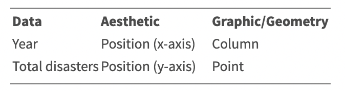
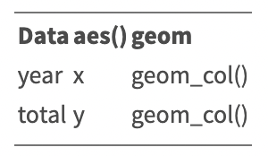
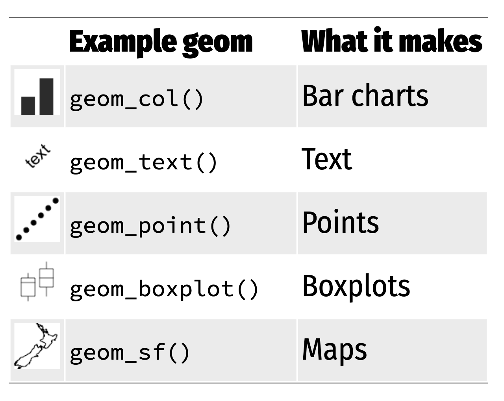
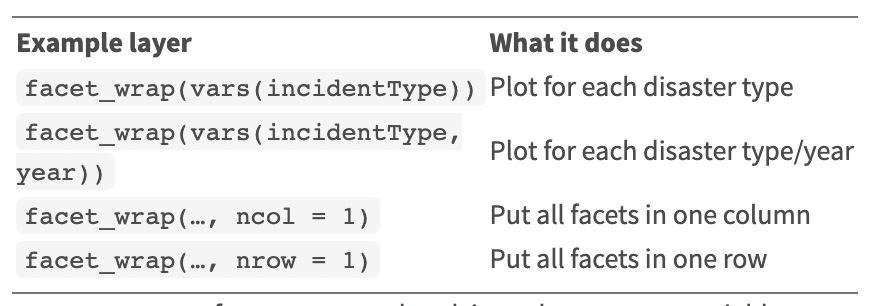
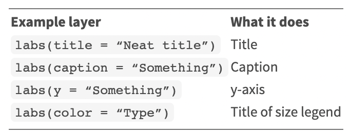
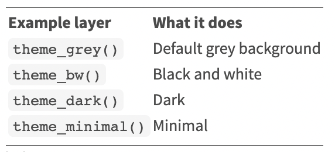
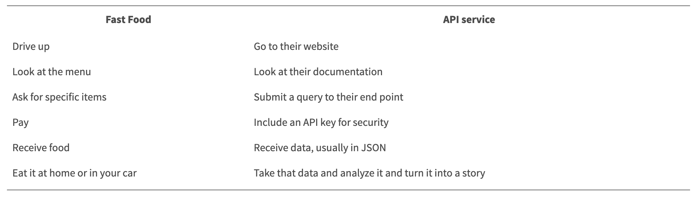

```{r, include=FALSE}
## By default, show code for all chunks in the knitted document,
## as well as the output. To override for a particular chunk
## use echo = FALSE in its options.
knitr::opts_chunk$set(
   echo=TRUE, message=FALSE, warning=FALSE
)
```

```{r, echo=FALSE}
# CONFIG
user_name <- "fernandomillanvillalobos" # your Git username (only needed if
# you want to deploy to GH pages)
project_name <- "adjclass-nando" # adapt!
package_date <- "2022-05-01" # date of the CRAN snapshot that
# the checkpoint package uses
r_version <- "4.2.1" # R-Version to use
options(Ncpus = 4) # use 4 cores for parallelized installation of packages
if (r_version != paste0(version$major, ".", version$minor)) {
  stop("ERROR: specified R version does not match currently used.")
}
```

# Notes

This report was generated on `r Sys.time()`. R version: `r paste0(version$major, ".", version$minor)` on `r version$platform`. For this report, CRAN packages as of `r package_date` were used.

...

## R-Script & data

The preprocessing and analysis of the data was conducted in the [R project for statistical computing](https://www.r-project.org/). The RMarkdown script used to generate this document and all the resulting data can be downloaded [under this link](http://`r user_name`.github.io/`r project_name`/). Through executing `main.Rmd`, the herein described process can be reproduced and this document can be generated. In the course of this, data from the folder `input` will be processed and results will be written to `output`. The html on-line version of the analysis can be accessed through this [link](https://`r user_name`.github.io/`r project_name`/). 

## GitHub

The code for the herein described process can also be freely downloaded from [https://github.com/`r user_name`/`r project_name`](https://github.com/`r user_name`/`r project_name`). 

## License

...

## Data description of output files

#### `abc.csv` (Example)

| Attribute | Type | Description |
|-------|------|-----------------------------------------------------------------------------|
| a | Numeric | ... |
| b | Numeric | ... |
| c | Numeric |  ... |

...

# Set up

```{r, echo=FALSE}
detach_all_packages <- function() {
  basic_packages_blank <-  c("stats",
                             "graphics",
                             "grDevices",
                             "utils",
                             "datasets",
                             "methods",
                             "base")
  basic_packages <- paste("package:", basic_packages_blank, sep = "")

  package_list <- search()[
    ifelse(unlist(gregexpr("package:", search())) == 1, TRUE, FALSE)]

  package_list <- setdiff(package_list, basic_packages)

  if (length(package_list) > 0)  for (package in package_list) {
    detach(package, character.only = TRUE, unload = TRUE)
    print(paste("package ", package, " detached", sep = ""))
  }
}

detach_all_packages()

# this allows multiple persons to use the same RMarkdown
# without adjusting the working directory by themselves all the time
source("scripts/csf.R")
path_to_wd <- csf() # if this - for some reason - does not work,
# replace with a hardcoded path, like so: "~/projects/rddj-template/analysis/"
if (is.null(path_to_wd) | !dir.exists(path_to_wd)) {
  print("WARNING: No working directory specified for current user")
} else {
  setwd(path_to_wd)
}

# suppress scientific notation
options(scipen = 999)

# suppress summarise info
options(dplyr.summarise.inform = FALSE)

# unload global rstudioapi and knitr again to avoid conflicts with checkpoint
# this is only necessary if executed within RStudio
# outside of RStudio, namely in the knit.sh script, this causes RMarkdown
# rendering to fail, thus should not be executed there
if (Sys.getenv("RSTUDIO") == "1") {
  detach_all_packages()
}
```

## Define packages

```{r, echo=TRUE, message=FALSE, warning=FALSE}
# from https://mran.revolutionanalytics.com/web/packages/\
# checkpoint/vignettes/using-checkpoint-with-knitr.html
# if you don't need a package, remove it from here (commenting not sufficient)
# tidyverse: see https://blog.rstudio.org/2016/09/15/tidyverse-1-0-0/
cat("
library(rstudioapi)
library(tidyverse)
library(tidylog)
library(jsonlite)
library(lintr)
library(rmarkdown)
library(rio)
library(cowplot)
library(extrafont)
library(ggrepel)
library(scales)
library(remotes)
library(lubridate)
library(rvest)
library(httr)
library(tidycensus)
library(ggthemes)
library(doParallel)
library(utils)
library(janitor)",
file = "manifest.R")
```

## Install packages

```{r, echo=TRUE, message=FALSE, warning=FALSE}
# if checkpoint is not yet installed, install it (for people using this
# system for the first time)
if (!require(checkpoint)) {
  if (!require(devtools)) {
    install.packages("devtools", repos = "http://cran.us.r-project.org")
    require(devtools)
  }
  devtools::install_github("RevolutionAnalytics/checkpoint",
                           ref = "v0.3.2", # could be adapted later,
                           # as of now (beginning of July 2017
                           # this is the current release on CRAN)
                           repos = "http://cran.us.r-project.org")
  require(checkpoint)
}
# nolint start
if (!dir.exists("~/.checkpoint")) {
  dir.create("~/.checkpoint")
}
# nolint end
# install packages for the specified CRAN snapshot date
checkpoint(snapshot_date = package_date,
           project = path_to_wd,
           verbose = T,
           scanForPackages = T,
           use.knitr = F,
           R.version = r_version)
rm(package_date)
```

## Load packages

```{r, echo=TRUE, message=FALSE, warning=FALSE}
source("manifest.R")
unlink("manifest.R")
sessionInfo()
```

## Load additional scripts

```{r, echo=TRUE, message=FALSE, warning=FALSE}
# if you want to outsource logic to other script files, see README for 
# further information
# Load all visualizations functions as separate scripts
knitr::read_chunk("scripts/dviz.supp.R")
source("scripts/dviz.supp.R")
knitr::read_chunk("scripts/themes.R")
source("scripts/themes.R")
knitr::read_chunk("scripts/plot_grid.R")
source("scripts/plot_grid.R")
knitr::read_chunk("scripts/align_legend.R")
source("scripts/align_legend.R")
knitr::read_chunk("scripts/label_log10.R")
source("scripts/label_log10.R")
knitr::read_chunk("scripts/outliers.R")
source("scripts/outliers.R")
```

# Module 1: Exploring data

In this lesson, we’re going to start exploring data with the package dplyr.

- It’s designed to work with data frames, which is what journalists are used to
- Great for data exploration and transformation
- Intuitive to write and easy to read, especially when using the “chaining” syntax of pipes
- These are the functions/data analysis verbs we’ll be going over:

- `filter()`
- `select()`
- `arrange()`
- `mutate()`
- `summarize()` plus `group_by()`

```{r, fig.cap=c("Module 1: Analyzing data with R"), out.width="100%", out.height="600px", echo=FALSE, fig.show='hold'}
knitr::include_graphics("input/pdf/ADJ_Class_1.pdf")  
```
```{r}
# getting the data https://www.fema.gov/openfema-data-page/disaster-declarations-summaries-v2
df <- read_csv("https://www.fema.gov/api/open/v2/DisasterDeclarationsSummaries.csv") %>% 
  glimpse()

# getting the range
range(df$incidentBeginDate)

# exploring the data with table()
table(df$incidentType)
# or with count()
incident_types <- count(df, incidentType, name = "total") # rename the default "n" column
incident_types

# arranging the data
incident_types_arranged <- arrange(incident_types, desc(total))
incident_types_arranged

# pipeing it all
incident_types_arranged <- df %>%
  count(incidentType, name = "total") %>%
  arrange(desc(total))
incident_types_arranged

# filtering
incident_types_arranged_filtered <- incident_types_arranged %>%
  filter(incidentType != "Biological")
incident_types_arranged_filtered

# filtering by multiple values
incident_types_arranged %>%
  filter(incidentType == "Tornado" | incidentType == "Hurricane")

# using an array to filter
disaster_array <- c("Tornado", "Hurricane", "Flood")
incident_types_arranged %>%
  filter(incidentType %in% disaster_array)

# missing values
head(is.na(df$incidentType))
sum(is.na(df$incidentType))

# using select()
nrow(df)
colnames(df)

df_narrow <- df %>%
  select(
    femaDeclarationString, state, declarationDate,
    fyDeclared, designatedArea, incidentType
  )
colnames(df_narrow)

# using slice()
rev_chron_floods <- df %>%
  filter(incidentType == "Flood") %>%
  arrange(desc(declarationDate)) %>%
  slice(1:5)
rev_chron_floods

# using mutate()
floods <- df %>%
  filter(incidentType == "Flood")
floods_adjusted <- floods %>%
  mutate(year = year(declarationDate)) %>%
  select(year, declarationDate, fyDeclared)
floods_adjusted

# using summarize()
floods %>%
  mutate(year = year(declarationDate)) %>%
  group_by(year) %>%
  summarize(total = n())

# using case_when()
floods_match <- floods_adjusted %>%
  mutate(
    year_match =
      case_when(
        year == fyDeclared ~ "Match",
        TRUE ~ "Not a match"
      )
  ) %>%
  group_by(year_match) %>%
  summarize(total = n())
floods_match

# using pull()
floods_match_count <- floods_match %>%
  filter(year_match == "Not a match") %>%
  pull(total)
floods_match_count

# getting the pct
total_obs <- nrow(floods)
floods_match_count / total_obs * 100
round(floods_match_count / total_obs * 100, 1)

# Which year had the most floods declarations?
annual_floods <- df %>%
  filter(incidentType == "Flood") %>%
  mutate(year = year(declarationDate)) %>%
  group_by(year) %>%
  summarize(total = n()) %>%
  arrange(desc(total))
annual_floods

# Which state has had the most flooding declared disasters?
state_floods <- df %>%
  filter(incidentType == "Flood") %>%
  group_by(state) %>%
  summarize(floods = n()) %>%
  arrange(desc(floods))
state_floods
```
# Module 2: Joins and Strings

Let’s take a moment to talk about the significance of __tidy__ data. It’s the prefix to a lot of the packages and functions we’re using in this class. But it’s also a philosophy when approaching the structure of data.

There’s an ideal structure for how to stack your data.

And that’s with

- Each __variable__ is in its own __column__
- Each __case__ is in its own __row__
- Each __value__ is in its own __cell__

A join combines two data sets by adding the columns of one data set alongside the columns of the other, usually some of the rows of the second data set along with some rows of the first data set.

A successful join requires something consistent between two data sets to match on: __keys__.

The function that’s used most often is `left_join()` because you have one main data set you’d like to supplement with additional columns.

The function works like this:

If the two data frames you want to join have __the same name__:

`left_join(data_frame1, data_frame2, by="shared_column_name")`

If the two data frames you want to join have __different names__:

`left_join(data_frame1, data_frame2, by=c("df1_column"="df_2_column"))`

Notice that the `c()` argument in the second example is different from how we’ve used it before as combine. The `=` column matching operator is specific to `_join()` functions.

 
Now there are a few other joins that have their uses.

- `right_join()`
- `full_join()`
- `semi_join()`
- `anti_join()`

There are many wonderful functions in the __stringr__ package that you do things like detect patterns, see if strings start with with a pattern, or split or join or substitute strings.

Nearly every news story that involves data analysis can be derived from one these formulas.

- Difference
  - x - y
- Percent
  - x / (x + y) * 100
- Percent change
  - (new - old)/old * 100
- Per Capita
  - x / population * some multiplier to raise result to a round number

```{r, fig.cap=c("Module 2: Joins and Strings"), out.width="100%", out.height="600px", echo=FALSE, fig.show='hold'}
knitr::include_graphics("input/pdf/ADJ_Class_2.pdf")
```

```{r}
census_api_key("02898df1b52d892523a165c11b8b9630e646f22b", install = TRUE, overwrite = TRUE)
county_pop <- get_acs(geography = "county", variables = "B01003_001", year = 2020)
df <- read_csv("https://www.fema.gov/api/open/v2/DisasterDeclarationsSummaries.csv")

# combining strings
df_new <- df %>%
  mutate(GEOID = str_c(fipsStateCode, fipsCountyCode))

# joining data frames
joined_new <- left_join(df_new, county_pop, by = "GEOID")
glimpse(joined_new)

# summarizing data
joined_new %>%
  group_by(incidentType) %>%
  summarize(
    declarations = n(),
    avg_pop = mean(estimate, na.rm = T),
    median_pop = median(estimate, na.rm = T)
  ) %>%
  arrange(desc(avg_pop)) %>%
  slice(1:5)

# wrangling data to compare the current months of 2022 with the past months (otherwise we’d be comparing 12 months of data in 2021 to 8 in 2022 which would be misleading)
joined_new %>%
  filter(state == "KY") %>%
  filter(incidentType == "Flood") %>%
  mutate(year = year(incidentBeginDate)) %>%
  # extracting months
  mutate(month = month(incidentBeginDate)) %>%
  # only paying attention to months in current year of data set
  filter(month %in% c(1:8)) %>%
  filter(year == 2020 | year == 2021 | year == 2022) %>%
  group_by(year) %>%
  summarize(
    declarations = n(),
    avg_pop = mean(estimate, na.rm = T),
    median_pop = median(estimate, na.rm = T)
  )

# getting percent
# x / (x + y) * 100
old <- 50 / (50 + 20) * 100
new <- 20 / (20 + 50) * 100

# getting percent change
#  (new - old)/old * 100
(new - old) / old * 100
```

Because you’re working with raw data intended for use by an agency for one thing, you’ll need to be able to reshape the data so you can do your own analysis, which will include math (such as difference, percents, percent change, and per capita).

One advanced technique for transforming data you’ll learn in this section is from the __tidyr__ package.

- pivot_wider()
- pivot_longer()

In R, you pivot data as in you reshape it. This way you can do math easier across all rows and easier to mutate and manipulate (and is also the preferable data structure for most data viz tools). However, if we wanted to make comparisons that would be difficult. So we need to turn this long data into wide data using `pivot_wider()`. What’s really powerful about `pivot_wider()` is the option to be able to draw values from more than one column.


To use the pivot_longer() function which needs:

1. What columns to focus on `cols=`
2. What to name the column with the names of the columns `names_to=`
3. What to name the column with the values `values_to=`

```{r}
# getting the data (long format)
long_flood <- joined_new %>%
  filter(incidentType == "Flood") %>%
  mutate(year = year(incidentBeginDate)) %>%
  # extracting months
  mutate(month = month(incidentBeginDate)) %>%
  # only paying attention to months in current year of data set
  filter(month %in% c(1:8)) %>%
  filter(year == 2020 | year == 2021 | year == 2022) %>%
  group_by(year, state) %>%
  summarize(
    declarations = n(),
    avg_pop = mean(estimate, na.rm = T),
    median_pop = median(estimate, na.rm = T)
  )
head(long_flood)

# pivoting the data (wide format)
wide_flood <- long_flood %>%
  select(-avg_pop, -median_pop) %>%
  pivot_wider(
    names_from = "year",
    values_from = "declarations"
  )
head(wide_flood)

# calculates the percent change between 2022 and 2021
flood_percent_change <- wide_flood %>%
  summarize(
    `2020` = sum(`2020`, na.rm = T),
    `2021` = sum(`2021`, na.rm = T),
    `2022` = sum(`2022`, na.rm = T)
  ) %>%
  mutate(percent_change = (round((`2022` - `2021`) / `2021` * 100, 1)))
flood_percent_change

# drawing values from more than one column
wide_flood_more <- long_flood %>%
  select(-median_pop) %>%
  pivot_wider(
    names_from = "year",
    values_from = c("declarations", "avg_pop")
  )
wide_flood_more

# getting new data
joined_new <- left_join(df_new, county_pop, by = "GEOID") %>%
  mutate(year = year(incidentBeginDate))
  
annual_disasters <- joined_new %>%
  count(incidentType, year, name = "total")

annual_fires <- annual_disasters %>%
  filter(incidentType == "Fire")
annual_fires

fires_wide <- annual_fires %>% 
  pivot_wider(
    names_from = "year",
    values_from = "total"
  )
fires_wide
```
The grammar of graphics lets you approach visualizations structurally, letting you combine and swap out graphical elements into figures that display data meaningfully.

__Aesthetic__

  - The visual property of a graph

  - Position, shape, color, etc.

__Data__

  - A column in a data set
  
Here’s are the core components of the chart above:



Here’s how the data was mapped in ggplot2 code from a data frame:



ggplot(data = DATA) +
  GEOM_FUNCTION(mapping = aes(AESTHETIC MAPPINGS))



Facets show subplots for different subsets of data. The table below shows all the different ways you can use facets– you can break it out by one extra variable or even two.


We can add more customizations to the chart.


Use themes to change the appearance of anything in the plot. While you can customize every font, color, gradient, etc, you can set these styles up ahead of time or use the ones others have created. There are many built-in themes. Make theme adjustments with `theme()`.



```{r}
# plotting the data
ggplot(data = annual_fires) +
  geom_col(aes(x = year, y = total))

# scoping the years to 2010 - 2022
ggplot(data = annual_fires) +
  geom_col(aes(x = year, y = total)) +
  scale_x_continuous(limits = c(2010, 2022), breaks = 2010:2022)

# using facets
annual_disasters %>%
  filter(incidentType %in% c("Hurricane", "Fire", "Flood")) %>%
  ggplot() +
  geom_col(mapping = aes(x = year, y = total)) +
  scale_x_continuous(limits = c(2010, 2022), breaks = 2010:2022) +
  facet_wrap(vars(incidentType), ncol = 1)

# customizing charts
annual_disasters %>%
  filter(incidentType %in% c("Hurricane", "Fire", "Flood")) %>%
  ggplot() +
  geom_col(mapping = aes(x = year, y = total)) +
  scale_x_continuous(limits = c(2010, 2022), breaks = 2010:2022) +
  facet_wrap(vars(incidentType), ncol = 1) +
  labs(
    title = "Disaster declarations since 2010",
    x = "",
    y = "Total",
    caption = "Data: FEMA"
  )

# using themes
annual_disasters %>%
  filter(incidentType %in% c("Hurricane", "Fire", "Flood")) %>%
  ggplot() +
  geom_col(mapping = aes(x = year, y = total)) +
  scale_x_continuous(limits = c(2010, 2022), breaks = 2010:2022) +
  facet_wrap(vars(incidentType), ncol = 1) +
  labs(
    title = "Disaster declarations since 2010",
    x = "",
    y = "Total",
    caption = "Data: FEMA"
  ) +
  # theme_minimal() +
  # bbc_style()
  theme_economist() +
  theme(
    plot.title = element_text(face = "italic")
  )
```
# Module 3: Loops

We create loops to simplify repetitive tasks. Using `i` is arbitrary. You could use any letter or object. But it does take the value of what shows up after `in`. If you want to see how many objects there are in an array, use `length()` and if you want to see how many rows there are in a data frame, use `nrow()` and if you want to see how many columns there are in a data frame, use `ncol()`. Sometimes you’re going to get data split out over several spreadsheets. Loops are a great way to simplify things. 

To make a loop work on importing spreadsheets, you’ll need to know:

1. How many times you need to run the loop
2. The names of the files
3. Figure out what you want to do with the files

First, we need to get the list of spreadsheets that we want to import. We’ll use the function called `list.files()`. Then we use a loop structure where we can use the sheets[i] to refer to specific sheets in the list.

This is the basic structure for if statements. You need a () and {}. You can do multiple tests, too.

if (logical test for true or false) { 
      do something 
   } else if (logical test for true or false) { 
   do something else 
   } else { 
   do this if prior logical tests failed 
   }

When we run scripts and loops currently, they’re done one at a time in a serial form. The next task won’t start until the one before it finishes. But modern computers have multiple cores which enables multiple computations to take place at the same time. There are many ways to run loops in parallel in R, but we’re going to use a package called __doParallel__. To see how many cores your computer’s working with use `detectCores()`. To tell R how many cores we want to use use `registerDoParallel(cores=X)`. One valid criticism about R is that because data is stored into memory, there is an actual limit to what processes it can run. But loops and parallelization can allow you to run analyses on smaller slices of the data before joining.

An API stands for an Application Programming Interface and is an intermediary between a data set and others. It’s a way for people outside someone’s system to query and ask for specific slices of data from the system without getting complete access to their system. It’s like a drive-thru menu at a fast food restaurant.


The basic steps of pulling data from APIs:

- Installed the “jsonlite” packages (later on you may need the __httr__ package)
- Make a “GET” request to the API to pull raw data
- Parse that data from its raw form through JavaScript Object Notification (JSON) into a usable format
- Write a loop to “page” through that data and retrieve the full data set

Once one has dissected the anatomy of an API, you can see how easy it is to build them! Basically anybody with an internet connection, an authorization token, and who knows the grammar of the API can access it. Most APIs are published with extensive documentation to help you understand the available options and parameters. There may be more complicated ways to access APIs that involve including headers. We get API requests into R simply using the R package __jsonlite__ and use the function `fromJSON()`. The __jsonlite__ package just transformed all the squiggles and commas from what you saw in the browser output and gave you a clean looking data frame. If we want multiple combinations of data we can use loops. URLs do not like spaces. URLs require special characters like spaces, quotation marks, and percent signs to be converted into UTF-encoded values. Your browser, if it loaded the URL, automatically replaced the space with a special character `%20`. The function `URLencode()` from the __utils__ package should set this up for us.

```{r, fig.cap=c("Module 2: Loops"), out.width="100%", out.height="600px", echo=FALSE, fig.show='hold'}
knitr::include_graphics("input/pdf/ADJ_Class_3.pdf")
```

```{r}
# basic for loop structure
for (i in 1:10) {
  print(i)
}

# using length()
states <- c("Texas", "Florida", "California", "New York", "Indiana", "Maine")

for (arbitrary_name in 1:length(states)) {
  print(arbitrary_name)
}

for (i in 1:length(states)) {
  print(str_c("array object ", i, " is ", states[i]))
}

# getting the data
df1 <- read_csv("input/covid_data/2020-01.csv")
df2 <- read_csv("input/covid_data/2020-02.csv")
df <- rbind(df1, df2) %>% 
  glimpse()

# getting the list of data files
sheets <- list.files("input/covid_data", full.names = TRUE)
sheets
length(sheets)

# importing the data in an iterative way (but not saving it!)
for (i in 1:length(sheets)) {
  read_csv(sheets[i])
  print(sheets[i])
}

# importing the data and saving as one big data frame
for (i in 1:length(sheets)) {
  df <- read_csv(sheets[i])

  # if first time looping, save df as big_df
  if (i == 1) {
    big_df <- df
  } else {
    # if not the first time looping, then rbind it to big_df
    big_df <- rbind(big_df, df)
  }

  print(nrow(big_df))
}
glimpse(big_df)

# detecting cores
detectCores()

# how many cores
registerDoParallel(cores = 4)

# checking system time
system.time(
  for (i in 1:length(sheets)) {
    df <- read_csv(sheets[i])

    # if first time looping, save df as big_df
    if (i == 1) {
      big_df <- df
    } else {
      # if not the first time looping, then rbind it to big_df
      big_df <- rbind(big_df, df)
    }

    print(nrow(big_df))
  }
)

# checking in pararell
system.time(
  big_df <- foreach(i = 1:length(sheets), .combine = rbind) %dopar% {
    read_csv(sheets[i])
  }
)

# getting JSON requests from APIs
url <-"https://arcos-api.ext.nile.works/v1/combined_county_annual?key=WaPo&county=Mingo&state=WV"
mingo <- fromJSON(url)
mingo

# getting more data
base <- "https://arcos-api.ext.nile.works/v1/combined_county_annual"
county <- "Palm Beach"
county <- URLencode(county)
state <- "FL"
info_key <- "key=WaPo"

API_URL <- str_c(base, "?county=", county, "&state=", state, "&", info_key)

fromJSON(API_URL)

# looping to make an API call
counties <- c("Broward", "Miami-Dade", "Palm Beach")
base <- 'https://arcos-api.ext.nile.works/v1/combined_county_annual'

for (i in 1:length(counties)) {
  county <- counties[i]
  county <- URLencode(county)
  state <- "FL"
  info_key <- "key=WaPo"
  API_URL <- str_c(base, "?county=", county, "&state=", state, "&", info_key)

  df <- fromJSON(API_URL)

  if (i == 1) {
    tidy_df <- df
  } else {
    tidy_df <- rbind(tidy_df, df)
  }
}

tidy_df
```
# Linting

The code in this RMarkdown is linted with the [lintr package](https://github.com/jimhester/lintr), which is based on the  [tidyverse style guide](http://style.tidyverse.org/). 

```{r echo=TRUE, message=FALSE, warning=FALSE, results='hide'}
# lintr::lint("main.Rmd", linters =
#               lintr::with_defaults(
#                 commented_code_linter = NULL,
#                 trailing_whitespace_linter = NULL
#                 )
#             )
# if you have additional scripts and want them to be linted too, add them here
# lintr::lint("scripts/my_script.R")
```
